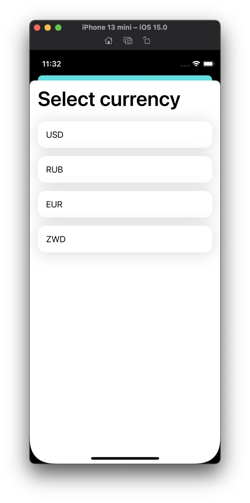

# Insecurity - the ultimate iOS navigation framework

This implementation of Coordinator pattern provides:
- Automatic `present`/`dismiss` calls for modal controller presentation
- Automatic `pushViewController`/`popViewController` calls for `UINavigationController` presentation
- Automatic dismissal/popping of **multiple** view controllers if all of them finish simultaneously
- Automatic detection of modal iOS 13 form sheet dismissal in modal presentation
- Automatic detection of `interactivePopGestureRecognized` dismissal in `UINavigationController`
- Propagation of results of showing a screen to the parent
- Ability to organize custom coordinators that allow for magical modification of `UINavigationController` stack or modal presentation stack
- Automatic management of a `UIWindow`

# Installation

Currently, only CocoaPods is supported. The minimum required iOS version is iOS 12, but it probably could run on iOS 8. This framework doesn't depend on anything.


```ruby
pod 'Insecurity'
```

# Getting Started

We start with having a "Select Currency" screen.
The screen will emit an event when the user selects a currency.
Once the selection is made, we need to close the screen.



We do this by subclassing `ModachildCoordinator`.

```swift
struct CurrencySelection {
    let currencyCode: String
}

class CurrencySelectionCoordinator: ModachildCoordinator<CurrencySelection> {
    override var viewController: UIViewController {
        let viewController = CurrencySelectionViewController()
        
        viewController.onCurrencySelected = { selection in
            self.finish(selection)
        }
        
        return viewController
    }
}
```

Then, we can start this coordinator from another `UIViewController`. We do this by creating an instance of `ModarollerCoordinator`.
```swift
class ParentViewController: UIViewController {
    func startCurrencySelection() {
        let modaroller = ModarollerCoordinator(galleryViewController)
            
        let currencySelectionCoordinator = CurrencySelectionCoordinator()
        
        modaroller.start(currencySelectionCoordinator, animated: true) { result in
            // The view controller was presented and dismissed automatically
            // `result` here is the currency that was selected
        }
    }
}
```

We have just called the method `ModarollerCoordinator.start`, and we passed a closure, that will receive the result of running the child coordinator. Additinally, you should know that all the required calls to the `present`/`dismiss` are handled for you.

However, in iOS 13 you can simply swipe down a modally presented view controller and it sorta just dies. What happens if user dismisses the `CurrencySelectionViewController` using a gesture? 

Well, we handle that for you.

```swift
class ParentViewController: UIViewController {
    func startCurrencySelection() {
        let modaroller = ModarollerCoordinator(galleryViewController)
            
        let currencySelectionCoordinator = CurrencySelectionCoordinator()
        
        modaroller.start(currencySelectionCoordinator, animated: true) { result in
            switch result {
            case .normal(let currencySelection):
                // Controller was dismissed after user has chosen a currency.
                // `currencySelection` has the actual type `CurrencySelection`
            case .dismissed:
                // Controller was dismissed using a gesture 
                // before any result was selected
                // You can handle it in a separate way
            }
        }
    }
}
```

When you get the result, you don't instantly get the result of `CurrencySelectionCoordinator`, the `CurrencySelection`. What you get instead is this:
```swift
enum CoordinatorResult<NormalResult> {
    case normal(NormalResult)
    case dismissed
}
```

If the `UIViewController` managed by the coordinator is dismissed before a `finish` was called, we don't have the actual result of the coordinator, so you receive the `dismissed` result. This also means that there is an important rule:

> ⚠️ **One coordinator == one `UIViewController` that it manages, no more no less**

There is more thing before we move on: in order to make this code actually work, we need to **retain** the `ModarollerCoordinator` and release it when we're done. Here is the valid and final code:

```swift
class ParentViewController: UIViewController {
    var customModaroller: ModarollerCoordinator?

    func startCurrencySelection() {
        let modaroller = ModarollerCoordinator(galleryViewController)
            
        let currencySelectionCoordinator = CurrencySelectionCoordinator()

        self.customModaroller = modaroller // Save the modaroller
        
        modaroller.start(currencySelectionCoordinator, animated: true) { [weak self] result in
            // Release the modaroller, don't forget to `weak self`
            self?.customModaroller = nil
            switch result {
            case .normal(let currencySelection):
                break
            case .dismissed:
                break
            }
        }
    }
}
```

# Philosophy

A process of showing a screen is an inherently functional operation. A classical Coordinator Tree implementation centers around a tree of objects. Parent coordinator retains the child coordinator, and so on and so forth. This tree can be freely traversed, usually for deeplinking propagation. However, the OOP-based model of Coordinator Tree doesn't advise anything on the event propagation, nor is it concerned with the quirks of using the navigation facilities of UIKit. And with this, comes an immense variety in visions of how the navigation is supposed to be performed.

This project however models the Coordinator Tree not in an object-oriented way, but a function-oriented way. A process of presenting a screen can be represented as an asynchronous function that accepts input data and emits output data asynchronously. Making a `UIWindow` key and visible is a function that returns `Never` in the single-window applications. A process of presenting a `UIViewController` modally is a function that returns the result of whatever the controller has settled upon. Same goes with pushing a view controller onto a `UINavigationController`. And these coordinators allow you to strictly define the results of their lifecycles.

Additionally, this framework forces you to build navigation in a magic-free way. A chain of modal view controllers can be resolved and dismissed simultaneously in a transparent way, that will involve your conscious decision. And if you really need to perform some magic, you can always leave the realm of automatically handled navigation and implement custom behavior in a compatible way.

Also, this framework uses the best it can take from functional programming without explicitly relying on FRP. The public interface is still Object-Oriented and the internal components are written in an efficient imperative style programming with careful state management, thoughtful memory management and lowest footprint possible mentality.

So, all in all, no `RxSwift` this time around. Though it's very compatible with `RxSwift`, a `Single` wrapper is very easy to write.

# Development

1. Clone the repo
2. `bundle config --set path vendor/bundle`
3. `bundle install`, make sure your Xcode can be found at `/Applications/Xcode.app`, otherwise the "ffi" package native extensions required by CocoaPods won't compile
4. `bundle exec pod install`
5. `open Insecurity.xcworkspace`